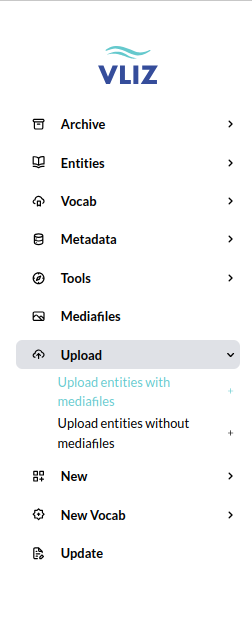

## Example for Bulk Uploading Files in Elody

#### Objective

In this example, we demonstrate how to upload a set of photos related to coastal management in Koksijde in 2014. The goal is to import these photos along with relevant metadata and link them as a single media entity with multiple media files in Elody.

### Step-by-Step Guide

#### Step 1: Open the Upload Form

Open the **upload module** in Elody via the sidebar. Select the "Upload entities with media files" option. Below is a screenshot with the highlighted option:



#### Step 2: Prepare the CSV File

To simplify the process, you can first upload the images via the form. Add three files you want to use and then select the option to download a sample CSV. This CSV will automatically include the filenames, making it easier to fill in the correct metadata.

For the solution CSV provided in this example, we are going to use `mediafile-1.jpg`, `mediafile-2.jpeg` and `mediafile-3.png` for simplicity purposes.

#### Step 3: Assign the Correct Context

In this step, assign the correct context to the files. This ensures that the right people within VLIZ have access to the files. If you are unsure which context to use, ask internally. For this example, we use the default context `general vliz`.

#### Step 4: Assign the Correct Value to the *same\_entity* Column

Ensure that all media files belonging to the same media entity share the same value in the *same\_entity* column. For this example, we use the number `1` throughout to indicate that the files belong to the same media entity.


#### Step 5: Assign Metadata to the Media Entity

1. **title**: For this example, we assign the title `Koksijde 2014` to the media entity.
2. **tag**: We link the tag `Coastal Management` as a relationship to the keywords entity. Ensure this tag is created in Elody beforehand so it can be linked correctly.
3. **marine_region**: Create a marine region with the title of Mediterranean Sea. To add this to the Media entity, place the title `Mediterranean Sea` in the second line in the column marine_region.

Additionally, fill in only columns A through T (e.g., *title*, *description*, *coordinates*, etc.) for the first row. Columns starting from U, which pertain to specific media files, can be filled in separately for each row.

#### Step 6: Assign Metadata and other relations to the Media Files

To indicate the owner of the media files, add `vliz` to the *mediafile\_owner\_person* column. This column must be filled in for each row because it pertains to individual media files and can vary by file if desired. For this example, we use `vliz` throughout.

To provide another example of how to associate related entities with media files, we will assign different Confidentiality entities to each media file.

Begin by creating three distinct Confidentiality entities with the following titles for simplicity: `Confidentiality 1`, `Confidentiality 2`, and `Confidentiality 3`.

In the Confidentiality column, assign Confidentiality 1 to the second row, which corresponds to the first media file.
Similarly, assign Confidentiality 2 to the third row, which corresponds to the second media file.
For the third media file, assign Confidentiality 3 in the fourth row of the CSV.

You may add any relevant metadata to the media files in the corresponding columns. Ensure that the data format matches the field type. For instance, enter a date in a date field and use only letters and numbers in a text field.

We are going to specify the usage guidelines until field for the second mediafile. Enter `31/12/2030` in the appropriate column on the third line of the CSV.
For the third media file, include a reference link to this documentation by entering  `https://github.com/inuits/elody-docs/blob/master/mkdocs/docs/csv-vliz-import-example.md` in the corresponding column on the fourth line of the CSV.

#### Step 7: Add multiple keywords an entity

To illustrate how you can add multiple keywords to a single entity, we will use the example of adding keywords to the `Koksijde 2014 Media` entity.

To add a second keyword, `Beach profiles`, place it on the third line in the media_keyword column underneath `Coastal Management`.
Ensure that the same_entity column for both keywords has the same identifier to link them to the same entity.

To add even more keywords, follow the same steps. Each new keyword should be placed on a new line under the `media_keyword` column. Make sure each line has the same identifier in the `same_entity` column to associate all keywords with the same entity.

#### Step 8: Link the Media to a parent Album entity

Ensure that you have created an Album entity through the user interface. For this example, create an album titled `Belgium Coast`.

Once the Album entity is created, you can link it to the Media entity in the CSV file. In the `album` column, enter `Belgium Coast` in the row corresponding to the Media entity (that is the second row of the CSV).

#### Step 9: Link the Media to a parent Collection Part entity

Ensure that you have created a Collection Part entity through the user interface. For this example, create a collection part titled `Tourist Destination`.

Once the Collection Part entity is created, you can link it to the Media entity in the CSV file. In the collection_part column, enter `Tourist Destination` in the row corresponding to the Media entity.

#### Step 10: Remove Placeholder Data

Ensure that all placeholder data, such as `title of a keyword for mediafile`, is removed from the CSV. These placeholders are meant as examples and must be replaced with actual data relevant to your media files and metadata.

#### Step 11: Upload the CSV

Now you can upload the CSV in the top window of the **upload module** and start the upload. Make sure the ZIP archive containing the media files is also uploaded as part of the process.

Below is an example of how your CSV should look:

|same_entity|title        |description|coordinates|context     |media_keyword     |language|asset_category|location_type|marine_region    |event|project|partner|album               |collection_part    |creator_person|owner_person|creator_partner|owner_partner|type                     | filename        |mediafile_copyright_color|content_drager|external_link                                                                           |usage_guidelines|usage_guidelines_until|embargo|qualityRating|mediafile_keyword|confidentiality  |person|mediafile_creator_person|mediafile_creator_partner|mediafile_owner_person|mediafile_owner_partner|
|-----------|-------------|-----------|-----------|------------|------------------|--------|--------------|-------------|-----------------|-----|-------|-------|--------------------|-------------------|--------------|------------|---------------|-------------|-------------------------|-----------------|-------------------------|--------------|----------------------------------------------------------------------------------------|----------------|----------------------|-------|-------------|-----------------|-----------------|------|------------------------|-------------------------|----------------------|-----------------------|
|1          |Koksijde 2014|           |           |general vliz|Coastal Management|        |              |             |Mediterranean Sea|     |       |       |Belgium coast       |Tourist Destination|              |            |               |             |media                    | mediafile-1.jpg |                         |              |                                                                                        |                |                      |       |             |                 |Confidentiality 1|      |                        |                         |vliz                  |                       |
|1          |             |           |           |            |Beach profiles    |        |              |             |                 |     |       |       |                    |                   |              |            |               |             |media                    | mediafile-2.jpg |                         |              |                                                                                        |                |31/12/2030            |       |             |                 |Confidentiality 2|      |                        |                         |vliz                  |                       |
|1          |             |           |           |            |                  |        |              |             |                 |     |       |       |                    |                   |              |            |               |             |media                    | mediafile-3.jpg |                         |              |https://github.com/inuits/elody-docs/blob/master/mkdocs/docs/csv-vliz-import-example.md |                |                      |       |             |                 |Confidentiality 3|      |                        |                         |vliz                  |                       |


#### Step 12: Validation and Error Checking

After importing, you can check in Elody whether:

- The files are correctly linked to the entities.
- The metadata and relationships have been imported accurately.

If there are errors, they will be displayed in Elody's UI. You can also download an updated CSV that includes the errors, making it easier to process and correct large CSV files.

#### Additional Information

For more detailed information on working with CSV files in Elody, visit the following documentation: [CSV Import Documentation](https://github.com/inuits/elody-docs/blob/master/mkdocs/docs/csv-import.md).

With this step-by-step guide, you can easily bulk upload files and link them to entities in Elody, as shown in this example of coastal management in Koksijde in 2014.

## Bulk import from shared drive (structured per album)

Elody supports structured bulk imports from a shared drive, using a folder-per-album approach. This method is ideal for handling large volumes of media files and structured metadata.

### Roles and responsibilities

- **VLIZ** provides folders per album, each containing the media files.
- **Inuits** prepares the required CSV files (`album.csv`, `default_values_for_media.csv`, and `media.csv`) for each folder, based on the shared import structure.
- VLIZ communicates to Inuits which albums are ready to be imported.

### Folder structure

Each album folder is expected to follow this structure:

- `album.csv`: metadata describing the album entity itself.
- `default_values_for_media.csv`: a single-row CSV defining default metadata for all media files.
- `media.csv`: a CSV listing each media file with optional per-file metadata.

The folder should also contain the actual media files listed in `media.csv`.

### Example folder contents

```
my_album/
├── album.csv
├── default_values_for_media.csv
├── media.csv
├── img001.jpg
├── img002.jpg
└── img003.jpg
```

### Workflow

1. VLIZ uploads the album folder and media files to the shared drive.
2. Inuits prepares and adds the CSV files to each folder.
3. VLIZ reviews the prepared folders and informs Inuits which albums are approved and ready for import.
4. Once approval is received, Inuits initiates the import process in Elody.
5. During import, Elody will:
   - Create the album entity from `album.csv`.
   - Load default metadata from `default_values_for_media.csv`.
   - Import media files based on `media.csv`, applying metadata from that file or falling back to the default values when specific fields are missing.

### Notes

- All CSVs must follow the standard Elody format (technical keys as column headers).
- Only one row is allowed in `default_values_for_media.csv`.
- Fields defined in `media.csv` will override the defaults.
- The `filename` field in `media.csv` must match the file names in the folder.

This approach ensures a smooth collaboration, with clear separation between content upload (VLIZ), metadata preparation (Inuits), and import control (via VLIZ approval).


### 🧾 Explanation of Column Types

Each field in the table below is associated with a specific input type. Here’s a brief explanation of each type:

- **`elody`**: A **UUID or title/name** of an entity in the Elody system. Refer to the provided link to find or create the correct entity.
- **`vocab`**: An **ID from your vocabulary service**. The value must come from a predefined controlled list.
- **`text`**: A **free text field**, optionally structured according to the specified format.
- **`date`**: A **date field** that must follow the indicated format (usually `dd/mm/yyyy`).


### Column Overview

| Column Name               | Type   | Link / Format                                          | 
|---------------------------|--------|--------------------------------------------------------|
| asset_category            | elody  | https://vliz-dams-dev.cloud.inuits.dev/assetCategories |
| collection_part           | elody  | https://vliz-dams-dev.cloud.inuits.dev/collectionParts |
| confidentiality           | elody  | https://vliz-dams-dev.cloud.inuits.dev/confidentiality |
| content_drager            | text   | free                                                   |
| context                   | elody  | https://vliz-dams-dev.cloud.inuits.dev/contexts        |
| coordinates               | text   | latitude, longitude (Decimal Degrees - DD)             |
| creator_partner           | vocab  | person                                                 |
| creator_person            | vocab  | person                                                 |
| description               | text   | free                                                   |
| embargo                   | date   | dd/mm/yyyy                                             |
| event                     | vocab  | event                                                  |
| external_link             | text   | hyperlink / ID                                         |
| filename                  | text   | prefilled / filename format                            |
| keyword                   | elody  | https://vliz-dams-dev.cloud.inuits.dev/keywords        |
| language                  | elody  | https://vliz-dams-dev.cloud.inuits.dev/languages       |
| location_type             | elody  | https://vliz-dams-dev.cloud.inuits.dev/locationTypes   |
| marine_region             | vocab  | marine region                                          |
| media_keyword             | elody  | https://vliz-dams-dev.cloud.inuits.dev/keywords        |
| mediafile_creator_partner | vocab  | partner                                                |
| mediafile_creator_person  | vocab  | person                                                 |
| mediafile_keyword         | elody  | https://vliz-dams-dev.cloud.inuits.dev/keywords        |
| mediafile_owner_partner   | vocab  | partner                                                |
| mediafile_owner_person    | vocab  | person                                                 |
| owner_partner             | vocab  | partner                                                |
| owner_person              | vocab  | person                                                 |
| partner                   | vocab  | partner                                                |
| person                    | vocab  | person                                                 |
| project                   | vocab  | project                                                |
| qualityRating             | text   | free                                                   |
| title                     | text   | free                                                   |
| type                      | elody  | Elody main type, prefilled                             |
| usage_guidelines          | text   | free                                                   |
| usage_guidelines_until    | date   | dd/mm/yyyy                                             |
